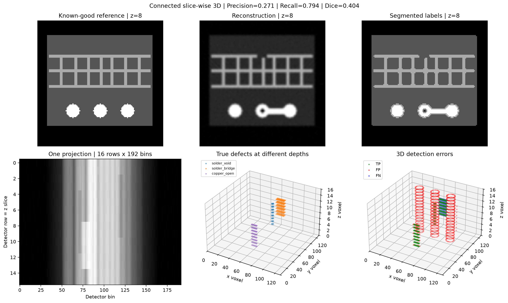

# Final portfolio result

## Language assistant extension

Notebook 05 adds a Colab-ready PyTorch/Hugging Face language model, attributed
BM25 retrieval and bounded inspection tools on top of the connected CT pipeline.
It preserves numeric evidence and renders reviewed Chinese/English explanations
selected by the model. It does not change CT detection accuracy or claim
fine-tuning. See the [assistant guide](LLM_ASSISTANT.md).
The [Colab T4 run](results/llm_colab_gpu_2026-10-03.md) verified Qwen2.5-1.5B
FP16 inference, the default workflow and three additional scenarios without
fallback, with 3.80 GiB peak allocated memory across the follow-up cases.
The executed notebook and original tool traces are archived.
Notebook 06 adds a [completed synthetic LoRA pilot](results/lora_colab_2026-10-04.md):
validation loss 0.5198 to 0.2830, unconstrained valid actions 7/18 to 13/18,
but evidence-selection validity 2/6 to 1/6. The adapter remains optional and
experimental; no improvement in CT detection accuracy is claimed.

## Outcome

The small proof of concept now connects the previously separate 2D CT and 3D
inspection modules. Notebook 04 reconstructs **16 independent slices** from
their projections, assembles a 16 × 129 × 129 attenuation volume, segments it,
and sends the resulting labels to the existing 3D inspector.

The input phantom has defects at different depths. The volume is **not** made
by copying a single reconstructed image, and detection does not read the
candidate's true material labels. A known-good, aligned reference is used for
comparison; defect truth is used afterward for evaluation only.

This completes the requested small integration. Full cone-beam reconstruction,
real-data registration, scanner calibration, and production benchmarking remain
optional future work. No additional complex module is needed to explain this
portfolio result honestly.

## Measured result

| Item | Local CUDA | Local CPU |
| --- | --- | --- |
| Actual reconstructed volume | 16 × 129 × 129, 16 µm voxels | Same |
| Projection stack | 180 angles × 16 rows × 192 bins | Same |
| ASTRA algorithm | `FBP_CUDA`, Hann | `FBP`, Hann |
| Shared-scale NRMSE | 0.064574 | 0.064146 |
| Voxel precision / recall / Dice | 0.271 / 0.794 / 0.404 | 0.275 / 0.794 / 0.409 |
| True-positive / false-positive / missed voxels | 692 / 1,859 / 180 | 692 / 1,823 / 180 |

These are strict voxel-overlap metrics, not object-level accuracy. The simple
threshold baseline has many false missing-solder boundary voxels and misses
part of the bridge. The GPU report's 82 material-difference components are
**not 82 true defects**. Physical measurements and root-cause suggestions are
candidate-region measurements and screening hypotheses, respectively.

The full experiment ran locally on an RTX 4060 Laptop GPU and CPU; **the updated
3D notebook has not been newly measured on a Colab T4**. See the
[complete result, manifests, and depth profiles](results/volume_bridge_2026-10-02.md).
There are 64 passing local tests with 97.03% coverage, including real ASTRA CPU
and available-GPU checks. CI covers Python 3.11–3.13 with the GPU-only test
skipped where hardware is unavailable.

## Reproduce

- [Run the connected 3D experiment in Colab](https://colab.research.google.com/github/yuweimin2077-hub/xsim-chip/blob/main/notebooks/04_slice_wise_3d_colab.ipynb)
- [Colab instructions](COLAB_GPU_WORKFLOW.md)
- [Earlier 2D closed-loop result](results/slice_closed_loop_2026-10-01.md)
- [Historical T4 single-slice run](results/colab_astra_smoke_2026-09-08.md)

Notebook 01 remains a standalone supplied-label example of the 3D inspector.
Notebook 02 remains a single-slice demonstration of the shared CT functions.
Notebook 04 connects those capabilities using a new depth-varying phantom.
Notebook 03's single-material spectral experiment remains separate.

## Resume-ready description

**Project:** Python-based X-ray CT defect inspection and root-cause screening
for semiconductor packaging

- Extended NIST's `xsim-chip` into a Colab-ready synthetic inspection pipeline,
  connecting parallel-beam projection, slice-wise ASTRA reconstruction, fixed
  material segmentation, and reference-based 3D defect analysis.
- Implemented depth-localized solder-void, solder-bridge, and copper-open test
  cases, 3D connected-component measurements, and independent voxel/volume
  evaluation; documented false positives and misses rather than claiming
  production-level accuracy.
- Verified a 16 × 129 × 129 volume locally on CUDA and CPU, with reproducible
  notebooks, runtime manifests, 64 local tests, and Python 3.11–3.13 CI.

## Interview explanation

“I reused a 2D CT reconstruction method to reconstruct every layer of a small
synthetic package independently. I stacked those results, segmented the
materials, and connected the output to a 3D reference-comparison module. This
lets me trace a suspected defect from projection data to its 3D location and
volume. The main limitation is boundary misclassification from simple
thresholding, which I quantified with strict voxel metrics. It is a simplified
parallel-beam engineering demonstration, not a validated industrial scanner.”
