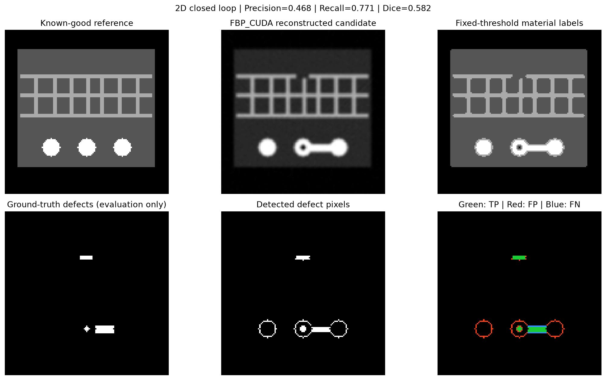

# Final portfolio result

## Outcome

This portfolio extension is complete at the reproducible proof-of-concept
level. It turns the NIST `xsim-chip` workflow into a Colab-first semiconductor
package XCT demonstration with deterministic defect injection, GPU
reconstruction, defect metrology, root-cause screening hypotheses, tests, and
run manifests.

The updated ASTRA notebook also closes the **2D** reconstruction-to-inspection
loop with fixed material segmentation and independent defect-mask evaluation.
Its [2026-10-01 result](results/slice_closed_loop_2026-10-01.md) was verified
locally on RTX 4060 CUDA and CPU. The separate 3D analytics notebook uses
supplied labels; a reconstructed 3D CT detection chain is not claimed.

The project deliberately stops here. Full scanner calibration, a complete
multi-material gVXR package, and production defect-detection benchmarking are
documented future work rather than claims made by this repository.

## Historical Colab reconstruction result

| Item | Result |
| --- | --- |
| Runtime | Google Colab, Python 3.13.15 |
| GPU | NVIDIA Tesla T4, CUDA compute capability 7.5 |
| Reconstruction | ASTRA 2.5.0 `FBP_CUDA`, Hann filter |
| Actual reconstructed slice | 129 × 129 pixels at 16 µm |
| Actual acquisition | 180 views × 192 detector bins |
| Noise model | Poisson, 100,000 photons |
| Projection + noise + reconstruction stage time | 0.2337 s |
| Normalized RMSE | 0.244846 |
| Planning-only 3D NumPy buffers | 0.0429 GiB (not measured memory) |
| Controlled defect pixels | void 13; bridge 88; copper open 30 |
| Current automated tests | 40 passing |

The normalized RMSE is a reproducible baseline, not an industrial acceptance
threshold. Attenuation values are relative, and the reduced reconstruction does
not model scatter, detector blur, or scanner calibration.
The archived 0.244846 RMSE uses the historical scaling/normalization; the
new pixel-size-scaled baseline has a different model and metric convention.

## Demonstrated workflow

1. Create a known-good 2D package reference and inject controlled defects.
2. Generate noisy Beer–Lambert projections and reconstruct the candidate slice.
3. Segment reconstructed attenuation using fixed material thresholds.
4. Compare segmented labels to the aligned known-good reference.
5. Report 2D components/areas and strict truth-mask precision, recall, Dice, IoU.
6. Save the report, comparison figure, arrays, and runtime manifest.

Separately, the first notebook compares supplied 3D material-label volumes
and reports component positions, physical volumes, severity, and testable
process hypotheses. Its input is not the second notebook's reconstruction.

## Reproduce in Colab

- [Defect-analysis notebook](https://colab.research.google.com/github/yuweimin2077-hub/xsim-chip/blob/main/notebooks/01_defect_analysis_colab.ipynb)
- [ASTRA GPU reconstruction notebook](https://colab.research.google.com/github/yuweimin2077-hub/xsim-chip/blob/main/notebooks/02_astra_colab_gpu_smoke.ipynb)
- [Reduced gVXR spectral notebook](https://colab.research.google.com/github/yuweimin2077-hub/xsim-chip/blob/main/notebooks/03_gvxr_colab_spectral.ipynb)
- [Archived ASTRA run record](results/colab_astra_smoke_2026-09-08.md)

## Resume-ready description

**Project:** Python-based X-ray CT defect inspection and root-cause analysis for
semiconductor packaging

- Extended NIST's open-source `xsim-chip` workflow into a reproducible Google
  Colab pipeline for synthetic package defects, X-ray projection, GPU CT
  reconstruction, fixed-threshold 2D segmentation, and reference-based defect
  evaluation; implemented a separate 3D labelled-volume inspection module.
- Implemented deterministic solder-void, solder-bridge, and copper-open test
  cases with material-aware connected-component analysis, severity ranking,
  physical measurements, and evidence-labelled root-cause hypotheses.
- Validated 129 × 129 2D ASTRA CUDA/FBP reconstruction on a Colab T4 and
  completed the detection chain locally on RTX 4060 and CPU; recorded strict
  GPU pixel recall of 0.771 and Dice of 0.582 with false-positive analysis,
  runtime manifests, 40 tests, and Python 3.11–3.13 CI coverage.

## Interview explanation

“I started from NIST's synthetic semiconductor-package CT project and focused
on making a smaller version reproducible in Colab. I added controlled defect
labels, a complete 2D reconstruction-to-inspection experiment, separate
quantitative 3D label-based defect reporting, and transparent
run metadata. The result is an engineering proof of concept rather than a
calibrated production inspection system, and the repository clearly separates
measured results from assumptions and future work.”

## Measured 2D closed-loop result

## Representative upstream images (not this experiment's result)

Ground-truth synthetic package slice:

Reconstructed XCT slice with simulated artefacts:

