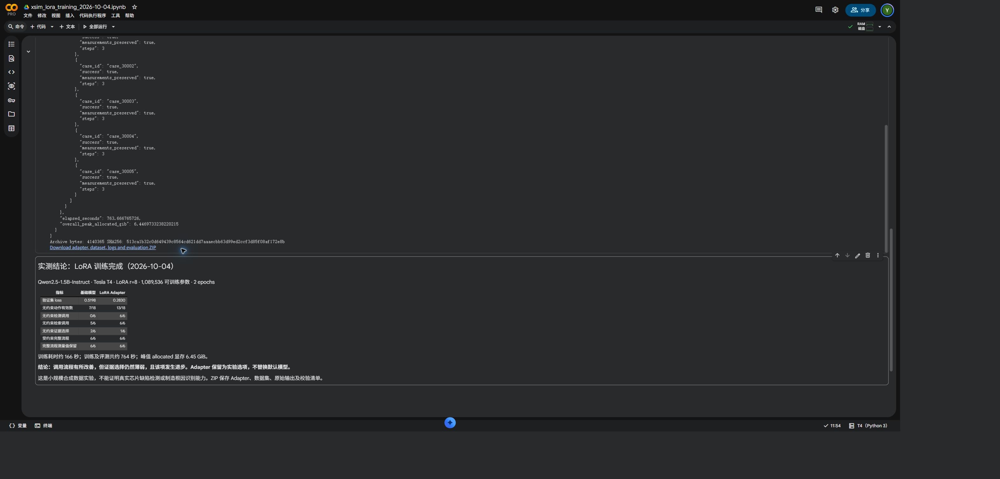

# Qwen2.5 LoRA/SFT pilot — actual Colab T4 run

**Training completed, but the adapter remains experimental and is not promoted
to the default model.** Tool initiation improved; unconstrained evidence
selection regressed. This is a small synthetic workflow experiment, not a
real-chip detection or manufacturing root-cause accuracy result.

## Measured comparison

| Metric | Base model | Saved and reloaded LoRA adapter |
| --- | ---: | ---: |
| Validation completion loss | 0.519802 | 0.282970 |
| Unconstrained valid next actions | 7/18 (38.9%) | 13/18 (72.2%) |
| Inspect registered case | 0/6 | 6/6 |
| Search with applicable evidence retrieved | 5/6 | 6/6 |
| Valid finding/source selection | 2/6 | 1/6 |
| Valid finish including an artifact alternative, where eligible | 0/5 | 0/5 |
| Constrained end-to-end cases without fallback | 6/6 | 6/6 |
| Exact inspection evidence preserved end-to-end | 6/6 | 6/6 |

The unconstrained metric uses teacher-forced histories on 18 turns from six
held-out cases. It is **not** an autonomous 72.2% case success rate. It checks
action structure, registered case ID, retrieval applicability and reference
validity; it is not a comprehensive truthfulness measure. Both models use greedy
decoding with a 256-token output budget. The full agent comparison separately
uses the existing stage-specific JSON decoder and deterministic report renderer.
Thus the 6/6 constrained result does not establish a training benefit.

The base model returned `{"selections": []}` instead of an inspection action on
all six initial prompts. LoRA corrected these six calls. However, the adapter's
only valid unconstrained finish was the zero-finding case. In three nonempty
cases it returned no selections; in two it mixed applicable and inapplicable
sources. All raw failures are retained in
[base outputs](lora_colab_2026-10-04/base_unconstrained.json) and
[adapter outputs](lora_colab_2026-10-04/adapter_unconstrained.json).

## Actual run

- Environment: Google Colab **Tesla T4**, Python and package versions recorded
  in [training.json](lora_colab_2026-10-04/training.json).
- Base: `Qwen/Qwen2.5-1.5B-Instruct`, revision
  `989aa7980e4cf806f80c7fef2b1adb7bc71aa306`, FP16, no 4-bit quantization.
- Code used for the experiment: `11f5f816c37aff0217bc5a9b147597143fb6f1cb`.
- PEFT 0.17.1; Transformers 4.57.6; Torch 2.11.0+cu130;
  Accelerate 1.15.0; lm-format-enforcer 0.11.3.
- LoRA: rank 8, alpha 16, dropout 0.05, `q_proj` / `v_proj`;
  **1,089,536 trainable parameters** out of 1,544,803,840 including the adapter.
- Two epochs / 36 optimizer steps; batch 1, accumulation 4, learning rate 1e-4,
  seed 20261004. Training time **165.63 seconds**; training and evaluation
  **763.67 seconds**, excluding installation and the later integration check.
- Peak PyTorch allocated GPU memory: **6.447 GiB**. Colab's larger live GPU RAM
  reading includes reserved memory and other allocations; these are different metrics.
- The saved adapter was reloaded before evaluation. Base results use PEFT's
  `disable_adapter()` context on the same frozen base weights.

## Dataset and limits

24 training / 6 validation / 6 test cases produce 72 / 18 / 18 supervised
next-action examples. Each case is an independently seeded ideal material array,
measured with the existing 2D/3D inspection code. There is no projection or
reconstruction in this synthetic training-data generator. Zero differences,
missing solder, excess solder and missing copper are represented.

All turns from a case remain in one split. Geometry fingerprints, case IDs and
question templates are disjoint across splits. Shared knowledge cards and the
workflow remain intentionally the same. Labels come from a programmatic teacher,
not domain experts. This does not test unseen defect classes or industrial data.

Only the final assistant completion receives loss. The training split contains
2,996 supervised tokens per epoch; the longest input is 1,983 tokens. This is a
very small pilot. The final epoch was fixed in advance; no tuning or checkpoint
selection used the test set. Validation loss improves, but the finish regression
prevents a claim that all assistant capabilities improved.

Dataset records, seeds, fingerprints and checksums are in the
[manifest](lora_colab_2026-10-04/dataset/manifest.json). The observed runtime loss
rows and full Trainer log history are archived. A later evaluator fix accepts
fenced JSON consistently for exact-teacher-match reporting; it does not change
the recorded primary validity counts.

## Reproduce and load

[Open training notebook in Colab](https://colab.research.google.com/github/yuweimin2077-hub/xsim-chip/blob/main/notebooks/06_lora_sft_colab.ipynb)
or follow the [training guide](../lora_training.md). The reusable notebook now
streams subprocess logs into its saved output. The executed archive retains the
actual source used for this run.

```bash
python -m pip install -e '.[training]'
xsim-assist \
  --report docs/results/volume_bridge_2026-10-02/volume_inspection_report.json \
  --model Qwen/Qwen2.5-1.5B-Instruct \
  --revision 989aa7980e4cf806f80c7fef2b1adb7bc71aa306 \
  --adapter docs/results/lora_colab_2026-10-04/adapter \
  --strict --output-dir outputs/lora_report
```

The [adapter directory](lora_colab_2026-10-04/adapter) contains only PEFT adapter
weights/configuration, not the full base model. Keep structured decoding and
reference validation enabled. The next training experiment should address
nonempty finish selections using a separate development set, then evaluate on
fresh held-out cases; this test set must not become a tuning target.

The public CLI was also exercised on the original reconstructed-volume report
containing **82 material-difference components**. It loaded the saved adapter
with the pinned base revision, completed three accepted tool calls without
fallback, selected six valid links and preserved the complete normalized
inspection evidence. Agent execution took **51.32 seconds**, excluding model
loading. See the [raw integration result](lora_colab_2026-10-04/original_pipeline_integration.json)
and [rendered report](lora_colab_2026-10-04/original_pipeline_integration.md).
This is an additional integration smoke test, not part of the six-case held-out
comparison and not evidence of improved detector accuracy.

## Evidence archive

- [Full evaluation](lora_colab_2026-10-04/evaluation.json)
- [Executed Colab notebook](lora_colab_2026-10-04/executed_colab.ipynb)
- [Training history](lora_colab_2026-10-04/training.json)
- [Artifact checksums](lora_colab_2026-10-04/archive_integrity.json)
- [Experiment model card](lora_colab_2026-10-04/MODEL_CARD.md)
- [Live saved Colab copy](https://colab.research.google.com/drive/1m_wNOYlm6us_-WqfZneN5MO1wVSjXveu)

Colab hides the large embedded ZIP output when saving to Drive. The ZIP was
downloaded from its visible link in bounded chunks and checked against the
printed SHA256 `513ca1b32c0d649439c8564cd621dd7aaaecbb63d99ed2ccf3d85f08af172e8b`
(4,140,365 bytes). A separate executed audit cell preserves the measured JSON
in the saved notebook. Transient UI metadata is removed from the archived copy;
code and measured numeric outputs are preserved.


