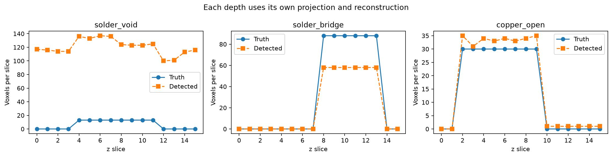

# Connected slice-wise CT reconstruction and 3D inspection

## Completed data connection

```text
Depth-varying candidate phantom (16, 129, 129)
  → independent noisy projections for all 16 slices
  → projection stack (180 angles, 16 detector rows, 192 bins)
  → the same 2D Hann FBP function used by Notebook 02, once per row
  → reconstructed attenuation volume (16, 129, 129)
  → fixed-threshold material labels
  → existing analyze_against_reference() 3D inspector
  → component positions, bounding boxes, volumes, severity, hypotheses
  → separate evaluation against defect truth
```

The new [Notebook 04](../../notebooks/04_slice_wise_3d_colab.ipynb) explicitly
connects the CT functions from Notebook 02 to the inspector demonstrated in
Notebook 01. It does **not** reuse one saved 2D image or the candidate's true
labels as the detection input. Each detector row is reconstructed independently.

This run was executed on **2026-10-02, America/New_York**, on local Windows;
manifest timestamps use UTC. Both RTX 4060 Laptop GPU and forced CPU runs
execute the notebook's Python cells through the same local runner. They are
**not new Colab T4 measurements**.


## Geometry and configuration

The reference is an extruded synthetic package cross-section. Candidate
defects have bounded, different z intervals; clean slices are retained.
All indices below are zero-based and the upper bound is exclusive.

| Injected signature | z interval | Ground-truth voxels | Ground-truth volume (µm³) |
| --- | --- | --- | --- |
| Solder void | [4, 12) | 104 | 425,984 |
| Solder bridge | [8, 14) | 528 | 2,162,688 |
| Copper open | [2, 10) | 240 | 983,040 |
| Union | — | 872 | 3,571,712 |

- Volume `(z, y, x)`: 16 × 129 × 129; isotropic spacing 16 µm.
- Projection stack `(angle, z, bin)`: 180 × 16 × 192; angles in [0, π).
- Poisson noise: 100,000 photons per ray; seed for slice z is `2060 + z`.
- Unit-pixel projection receives attenuation × 0.016 mm; FBP output is
  divided by 0.016 before segmentation. Coefficients remain synthetic.
- Shared fixed thresholds: 0.075, 0.40, 0.80; not fitted to defect truth.
- 3D component filter: minimum 8 voxels, 26-neighbour connectivity.
- Python 3.12.3, ASTRA 2.5.0, NumPy 2.5.3, SciPy 1.18.1.

This is an idealized **slice-wise parallel-beam model**: rays have no z
component, detector rows align with volume slices, and there is no z mixing.
Under these assumptions, the slice reconstructions form a volume. It is not
cone-beam reconstruction. ASTRA documents the underlying
[2D geometry](https://astra-toolbox.com/docs/geom2d.html),
[FBP algorithm](https://astra-toolbox.com/docs/algs/FBP.html), and
[3D parallel geometry](https://astra-toolbox.com/docs/geom3d.html).
The row-independent modelling choice is this demo's explicit simplification.

## Measured result

| Measurement | CUDA run | CPU fallback |
| --- | --- | --- |
| Algorithm | `FBP_CUDA` | `FBP` |
| Independently reconstructed slices | 16 | 16 |
| Shared-scale NRMSE | 0.064574 | 0.064146 |
| Zero-photon rays | 0 | 0 |
| Projection + noise | 0.075848 s | 0.215031 s |
| Reconstruction wall time | 0.629073 s | 0.142940 s |
| FBP execution + readback, summed over slices | 0.597770 s | 0.127381 s |
| Segmentation + 3D inspection | 0.251194 s | 0.209209 s |
| Acquisition + reconstruction + inspection | 0.957750 s | 0.568820 s |
| Strict union precision | 0.271266 | 0.275149 |
| Strict union recall | 0.793578 | 0.793578 |
| Strict union Dice | 0.404324 | 0.408621 |
| Strict union IoU | 0.253387 | 0.256772 |
| True-positive / false-positive / missed voxels | 692 / 1,859 / 180 | 692 / 1,823 / 180 |

Timings are single wall-clock samples including initialization and some
orchestration overhead, not comparative performance benchmarks. CPU and CUDA
projector implementations differ; their noisy data and results need not match
bit-for-bit. NRMSE uses `sqrt(mean(((truth - reconstruction) / 0.95)**2))`.

### CUDA per-signature evaluation

| Signature | TP | FP | FN | Precision | Recall | Dice | Signed volume error |
| --- | --- | --- | --- | --- | --- | --- | --- |
| Missing solder / void | 104 | 1,824 | 0 | 0.053942 | 1.000000 | 0.102362 | +1,753.85% |
| Excess solder / bridge | 348 | 0 | 180 | 1.000000 | 0.659091 | 0.794521 | −34.09% |
| Missing copper / open | 240 | 35 | 0 | 0.872727 | 1.000000 | 0.932039 | +14.58% |
| Union | 692 | 1,859 | 180 | 0.271266 | 0.793578 | 0.404324 | +192.55% |

Volume error is `(predicted volume − truth volume) / truth volume`, using all
retained voxels of that signature. It is not an object-matched metrology error.
Union predicted volume is 10,448,896 µm³ versus truth 3,571,712 µm³.

The key result is the verified **data connection**, not high detection accuracy.
Simple thresholding after Hann-filtered reconstruction creates false
missing-solder regions at bump boundaries, including on defect-free slices.
It also misses 180 bridge voxels. These errors are retained in the metrics and
figures; no ground-truth-dependent cleanup is applied.

The general inspector reports **82 material-difference components** on CUDA
(83 on CPU), across six signatures. This is not the number of true physical
defects, nor the count of the three evaluated signature masks. Severity and
process hypotheses apply to candidate differences and require confirmation.



## Evidence and reproduction

- [GPU runtime manifest, per-layer records, and metrics](volume_bridge_2026-10-02/gpu_run_manifest.json)
- [CPU runtime manifest, per-layer records, and metrics](volume_bridge_2026-10-02/cpu_run_manifest.json)
- [GPU 3D component report and evaluation](volume_bridge_2026-10-02/volume_inspection_report.json)
- [Run the connected notebook in Colab](https://colab.research.google.com/github/yuweimin2077-hub/xsim-chip/blob/main/notebooks/04_slice_wise_3d_colab.ipynb)

```bash
python -m pip install -e ".[simulation]"
python tools/run_slice_notebook.py --volume --output-dir outputs/volume_bridge_gpu
python tools/run_slice_notebook.py --volume --cpu --output-dir outputs/volume_bridge_cpu
```

In Colab, run all cells and retain `/content/xsim_volume_outputs`. The output
includes projections, reconstructed attenuation, segmented labels, reference
labels, truth labels/masks, predicted masks, figures, report, and manifest.
Generated arrays stay outside Git; the small evidence files above are archived.

Tests verify that different detector rows drive their own reconstructions,
connected voxels span z slices, ideal material stacks reach the existing 3D
report correctly, and copying the clean first slice fails to recover the
depth-localized defects. There are 64 passing local tests, with 97.03% coverage.
The refactored single-slice GPU experiment also retains its previous NRMSE
and detection metrics exactly.

## Deliberate stopping point

This closes the requested small 2D-to-3D bridge. It does not validate real-data
registration, cone divergence, scatter, detector blur, calibrated material
coefficients, industrial detection thresholds, or causal process diagnosis.
Those extensions are unnecessary for demonstrating the completed integration
and remain optional future work.
